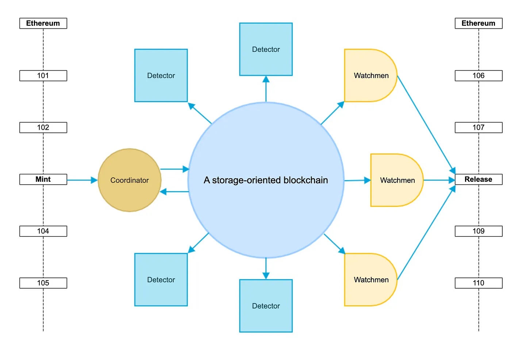
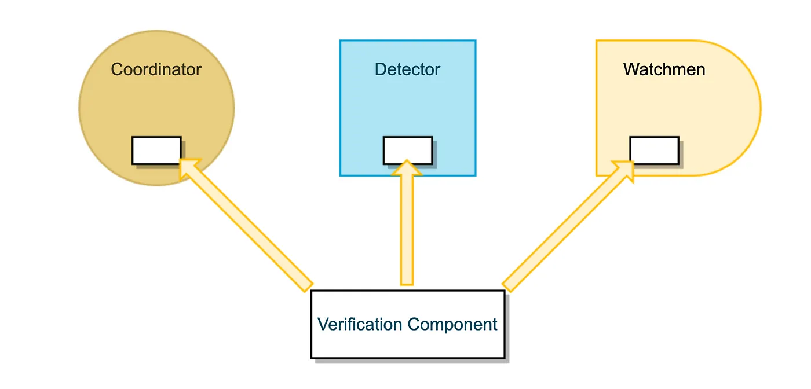

# 简介

## 存储计算范式探索：简析跨链支付协议 everPay 运行机制

比特币/以太坊计算资源稀缺，转账费用高昂，难以满足普通转账需求。everVision 使用存储应用范式构建 everPay，一个可信跨链支付结算协议。

everPay 协议将其他公链的资产锁入智能合约中，在协议上映射生成对应资产，资产生成后用户就可以在协议上进行任意的转账和支付。everPay 的交易的共识成本非常低，进行上万笔交易仅需要 0.5 美金。everPay 的 TPS 没有固定的限制，仅取决于协议的应用架构和服务器性能。协议只要满足存储计算范式标准，即可以进行“无限”的拓展，性能可以媲美传统联网应用。

### 运行机制

### 协议角色

#### 协调者（Coordinator）

负责交易采集、验证和上链。协调者通过 API 将用户的合法交易采集到序列化的 Pending 池中，并按照一定的时间周期将 Pending 池中的交易批量（rollup）打包上链。协调者会根据交易生成一个实时的全局状态，这个状态所有合法的链上交易和 Pending 池中交易计算的最终结果。

#### 检测者（Detectors）

检测程序会自动下载和校验链上数据，生成全局状态和余额。检测程序的状态会比协调者慢一步，检测程序只以链上数据为准，不加载协调者 Pending 池交易中还未打包的交易。任何人都可以下载和运行检测者程序，成为检测者。

#### 守望者（Watchmen）

多签治理成员，生成提案和签署提案，提案只有获得了大多数（>51%）守望者的签署后才能执行。

### 资产跨链

everPay 协议目前支持两种跨链方案，分别是多签和门限签名。

#### 多签

支持智能合约的公链，everPay 采用多签技术部署一个锁仓合约。多把密钥由不同的守望者持有。

协议监听到资产转入事件，并确保交易确认后在 everPay 协议上映射出对应的资产。

当用户发起资产销毁交易，该交易经过验证后会打包到存储型区块链上（Arweave）。守望者监听存储型区块链，对用户的销毁交易进行验证，然后签署有效的销毁交易发送到公链。当一定数量的守望者完成多签后，释放锁仓资产到用户。

#### 门限签名

对于不支持智能合约的公链，暂采用门限签名技术来保证用户资产锁定。机制与多签类似。

### 共识

协议共识通过存储计算范式进行保障。在存储计算范式中，所有计算过程在链下完成，应用的输入参数全部存储到区块链上。协调者、检测者和守望者都运行了相同的业务验证组件，任何人都可以下载和运行检测程序，加载区块链上的数据进行交易状态检查。

everPay 将所有类型的交易，包括 mint/burn/transfer 按照正确的交易顺序打包到存储型区块链上。第三方应用和个人可以使用检测程序进行状态检查，程序会自动加载并验证所有在链上的交易记录。如果协调者和检测者状态不一致，则说明应用可能存在共识欺诈风险。

### 无法作恶

交易都会按照顺序被序列化打包到区块链上，只要按照区块链上的打包顺序加载交易，最后生成的状态都是一致的。

#### 错误的签名

将错误签名打包到链上是无意义的，所有检测者都会拒绝错误的签名。

#### 余额攻击

所有的交易都会序列化的执行，无法进行双花攻击。同时交易中包含 nonce 字段，用于保护交易唯一性，防止用户进行重放。

目前只有一个协调者进行交易处理，如果协调者作恶怎么办？在用户仅有 1 ETH 的余额时，允许该用户发送了 2 ETH 的转账交易并被打包到链上。此时任何检测者都下载来自区块链上的序列化数据，发现用户仅有 1 ETH 余额，2 ETH 的转账被拒绝，交易打包后协调者的错误交易会被立即发现。另外一种情况下，用户余额是 1 ETH 余额。协调者允许用户连续发送了两次 1 ETH 转账交易，第一笔交易被检测者获得，用户余额从 1 变成 0，第二笔交易也被检测者获得，第二笔交易由于余额不足被拒绝。

#### 资产 Mint/Burn

在以太坊为用例中，会部署一个机器人（EthBot）用于监听 ETH 事件，用户将资产转入多签智能合约后，机器人会确保交易已经经过 20 个区块后发起 Mint 交易到 everPay 协议，协议会对该以太坊交易进行密码学校验，并再次查询以太坊节点该交易是否已经打包超过 20 个区块确认。资产成功 mint 后，交易指纹会在协议中标记为“minted”，避免重复资产重复 mint。

:::tip 注意
* 注意: EthBot 不是必须的，仅用于提升用户体验。任何人都可以把合法以太坊的交易发送到协议进行资产 mint。
:::

如果用户发起 burn 交易，合法的 burn 会被协议验证后打包到 Arweave 上。守望者们监听 Arweave 事件，验证交易后发送多签交易。同样地，以太坊锁仓合约会验证交易指纹，保障交易唯一，不被重复执行。

以上所有过程都可以通过 everPay 协议的检测程序进行检查，任何人都可以下载，成为检测者。同时，everPay 也会提供交易浏览器便于用户查看和检查交易。

协议的共识通过存储型区块链保障，由检测程序进行校验检查。

### 交互体验
#### 易用性
使用了协调者采集交易，交易会按照固有的顺序批量（rollup）上链。批量上链就可以将用户交易在链下实时处理，协调者的账本状态是实时更新的。

因此，用户在使用应用时，可以得到实时的转账体验，也支持用户进行连续的多笔交易。体验非常的接近互联网应用，快捷而便利。

极端情况下用户对协调者存有疑惑，可以查看交易浏览器等待交易打包，再确认该笔交易。一般而言，协调者会确保所有交易按照固定顺序打包上链。

### 灵活的签名算法
存储计算范式仅在链下进行计算，开发上非常的灵活，可以使用任意的签名算法。更进一步，everPay 可以集成更友好的互联网签名算法。比如 Webauthn（R1），在保证用户安全的同时将密钥管理（助记词）完全去掉，此时用户只需要使用硬件设备（手机、电脑）即可完成安全可靠的交易签名。

### 结语
everVision 的目标是提升用户体验，降低开发门槛，为所有人提供去中心化可信的金融应用。everPay 是一个区块链易用性的解决方案和应用协议，在保障可信的前提下，为用户提供接近互联网的支付结算体验。

了解更多:
* 关于存储计算范式请参考: https://mp.weixin.qq.com/s/EL-OXOgeL3Q-rzXbHV8IhQ
* https://medium.com/everFinance/a-storage-based-computation-paradigm-enabled-by-arweave-de799ae8c424

everVision website: https://ever.vision

<!-- TODO: -->